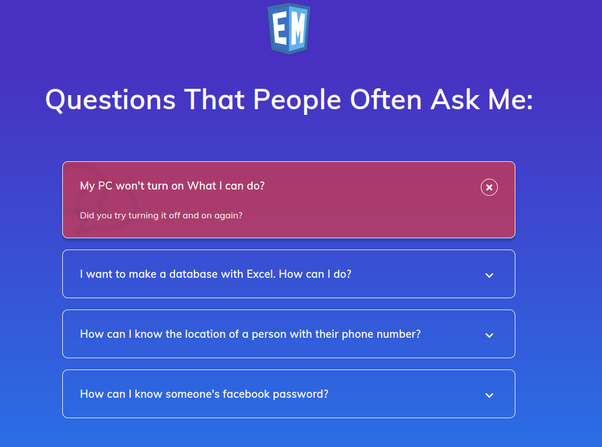

## Example n° 11: Create a FAQ section
### ( HTML - CSS - JS )

## What is this repository about?
It is a project of the typical "FAQ section" of any site.

## ¿De qué trata este repositorio?
Es un proyecto de la típica "FAQ section" de cualquierl sitio.

## Tecnologías utilizadas:

* 